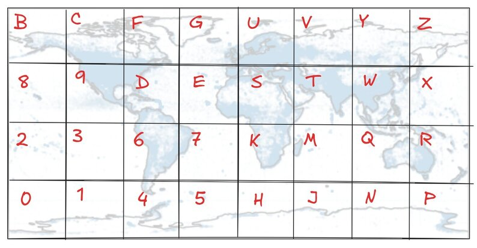

# How places and events are displayed on the map in Landnotes

Just like in any map website, as a user zooms in on smaller regions, new markers forplaces and events start appearing. The implementation of this mechanism (often referred to as "Levels of Detail") impacts has a big impact on the user experience:

- It is opinionated: markers that appear at the world level will be shown to more users than the ones that only appear at the level of a city district. We need to ensure that the pages at the top levels are the most interesting ones.
- It is database-intensive: as the users zoom and pan all over the map, we want to make sure the queries made in the background are as efficient as possible, in part to keep the website fluid and reactive, and in greater part because the database provider, CloudFlare, charges per database row scanned.

This page describes how Levels of Detail works in Landnotes.

## Quadrant-based geohashing

To explain how we make new markers progressively appear as a user zooms in, we have to first talk about geohashing, whereby we attribute a short string to different regions of the world.

In the most common geocoding method, we first split the world in a grid of 32 regions and each region receives a character (note that some characters like A, I, O are not used for legibility reasons):

This division of the world is actually great from a Wikipedia data perspective, where the regions with the most pages in the English wikipedia are the UK, the US East Coast, the USE West Coast, India, Japan... These fall in different squares, which will make it easy to split some of our datasets along these regions without having one dataset being much larger than the others.

In the standard geohash, the next step is to split each of the 32 regions in 32 smaller regions, for a total of 1024 regions, for instance here is region D, and it's subdivisions D0, D1, ... DZ:

By iterating the division process just 8 times, we can get a geohash like `u09tvmqr` which points to a plate with a resolution of just a couple meters, largely sufficient for the purposes of Landnotes, which maps sites and monuments.

While the division of each region in 32 smaller regions is neat and efficient, it is not the best to go with map zooming. In the map framework used by Landnotes, LeafletJS, increasing the zoom level by one means halving the latitude and longitude resolution. It is as if we were going one level deeper, not by diving into a 32 times small subregion, but a 4 times smaller subregion.

Therefore, passed the original 32-region partition, we use a quadrant-based division of the earth, where region D is divided in 4, then each quadrant is divided in 4, and so on:

There might not be a name for this type of geohashing, so let's call it "geoquashing". It are less concise than its 32-based cousin: achieving a resolution of a few meters now requires to have 17 characters which will look like `D2012302320010232`. On the other hand, they are practical because they follow the zoom level resolution. For instance we could decide that when the zoom level is 4, we will subdivide the screen using 4-length geoquashes (`G1201`, `G1202`, ...) and when the zoom level is 7 we'll look at the content of regions defined by 7-length geoquashes (`G1201322`, `G1201323`...)

Now the question becomes: what do we show when we show the content of `G1201322`?

## Hierarchizing locations

The different levels of geohash regions can be nicely represented as a tree:

Note that in practice, we never really need to encode a tree because geohashes are predictible: it is always obvious what the children of `G12312` are (just add 0, 1, 2 or 3) and who its parent is (remove the last character). But trees are a nice way to represent what's going on.

Now say that we have ranked the places and events in the world from the most interesting to the least interesting (more on this in the next section), and we want the most interesting ones at the highest zoom level. The way we do this is by pushing the events down the geohash tree, by order of importance, each event claiming the regions at various levels that have not been claimed yet:

Once we are done, each subregion at each sublevel should have its "best entry":

And now we know exactly what to show at each zoom level:

Each site (Cap Canaveral, Statue of Liberty, etc) can now be stored in a database with an index corresponding to the highest geohash for which it is the best entry. Cap Canaveral will be indexed as "D", the Statue of liberty as "D2", The white house as "D23", and so on.

In addition but not covered in details here, through the same tree-pushing algorithm, we also log the "next 10" entries for each node, which we will use to display "dot markers" as small wisual cues of what regions have more sites at lower zoom levels.

## Retrieving the entries to display in a given region

Say a user is currently viewing the region corresponding to latitude [45-55], longitude [-5 - 10], with a zoom level of 5.
It is relatively easy, with an algorithm, to determine all the geoquashes of size 5 or less that overlap with this region.

Now all we have to do is to request these ~30 entries to the database, which will be very efficient since the database is already indexed by "highest geoquash" and will typically take less than 50 row scans.

We can now display the markers for the sites that have been retrieved, along with their corresponding "dot markers" for other sites in the top 10 in each region.

## Ranking places and events

Which places should be first, and have a marker at the world level, while other places only appear at street level?

The answer is subjective and depends on goals. Landote tries to foster discovery of interesting topics and well-documented wikipedia pages, and so the criteria is simply "the size of the wikipedia page".

Initially, Landnotes used the total number of characters in a page as a the score (the wikipedia dumps provide that number for each wikipedia page). But the longest pages often owe their length to a high number of journalistic references, because they cover current events and controversial subjects (conflicts, assassinations, politicians). Having these pages appear first made for a grim world, so the page length is now measured after removing all references (using a regex), which favors pages with actual wikipedia content.

There could be alternative criteria for page ranking, based for instance on the number of wikipedia pages that link to a given page, similar to how Google used to rank the internet back in the 2000s.
